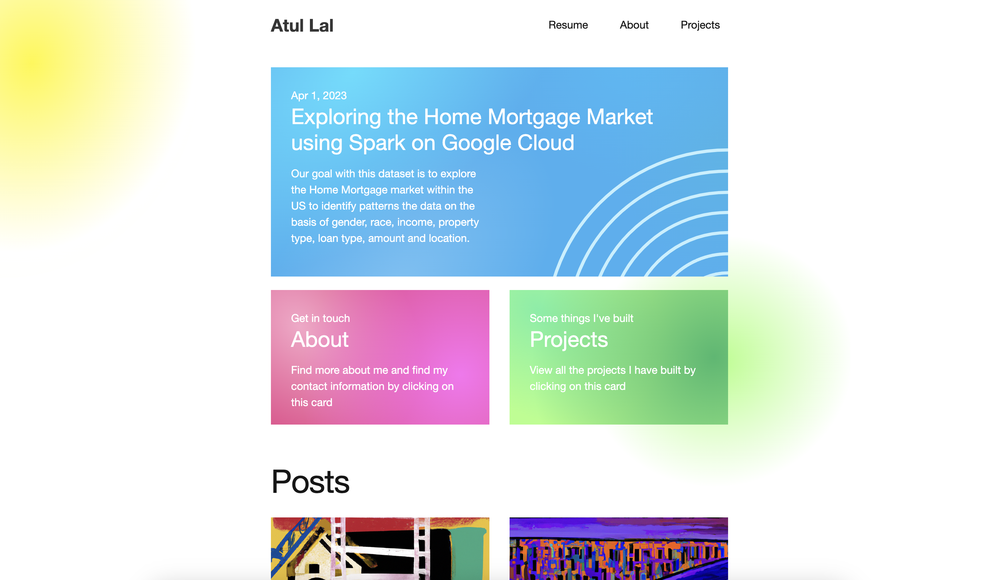

# Atul Lal's Personal Blog

Welcome to my personal blog! This repository contains the code for my blog hosted on GitHub Pages using Jekyll. In this blog, I share my thoughts, experiences, and insights related to computer science.

## Features

- Informative articles on various topics
- Clean and responsive design
- Easy navigation and search functionality
- Integration with social media platforms for sharing

## Getting Started

To view and explore my blog locally, follow these steps:

1. Clone the repository: `git clone https://github.com/atullal/personal-blog.git`
2. Install Jekyll: `gem install jekyll`
3. Navigate to the repository: `cd personal-blog`
4. Start Jekyll server: `jekyll serve`
5. Open your browser and visit `http://localhost:4000` to view the blog.

## Folder Structure

- `_layouts`: Contains layout files for different pages
- `_posts`: Stores blog posts written in Markdown
- `assets`: Includes static assets such as images and CSS
- `_config.yml`: Configuration file for Jekyll

## Contributing

If you find any issues or have suggestions for improvement, feel free to open an issue or submit a pull request. Contributions are always welcome!

## Contact

If you have any questions or want to connect, you can reach me at atul@atullal.xyz.

---

Thank you for visiting my personal blog. I hope you find the content valuable and enjoy exploring the articles!

